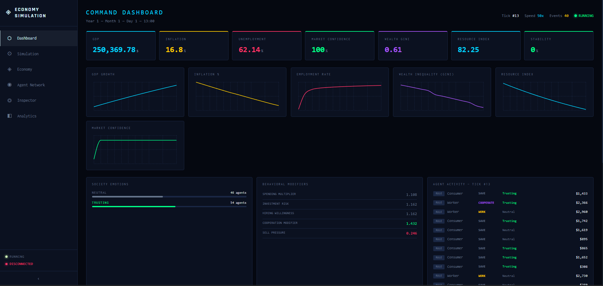

# Economy Simulation



A real-time AI-powered economic civilization simulator where 100 autonomous agents live, trade, panic, recover, and evolve inside a dynamic virtual economy. You control the world — adjust taxes, interest rates, resource supplies, and watch the society respond.

---

## What It Does

The simulation runs a living economy with 100 AI agents, each with their own profession, wealth, emotions, and memory. These agents interact with each other and the economy every tick. Left alone, the system naturally produces recessions, market crashes, panic waves, innovation booms, and recoveries — all without any scripting.

You can watch it unfold in real time, intervene with policy changes, speed it up or slow it down, and replay historical moments.

---

## Tech Stack

| Layer | Technology |
|-------|-----------|
| Frontend | React, Tailwind CSS, Recharts, D3.js |
| Backend | Django, Django REST Framework, Django Channels |
| Database | PostgreSQL with pgvector |
| Real-Time | WebSockets via Redis |
| Background Jobs | Celery |
| AI — Elite Agents | LangChain, LangGraph, OpenRouter API |
| AI — Smart Agents | PyTorch neural network |
| AI — Crowd Agents | Rule-based deterministic logic |

---

## The 100 Agents

Every agent has a profession, wealth, emotion state, memory, and a strategy. They are split into three intelligence tiers.

| Profession | Count | Intelligence | Role |
|-----------|-------|-------------|------|
| Consumer | 35 | Rule-based | Spend money on goods |
| Worker | 20 | Rule-based | Earn wages, seek employment |
| Trader | 10 | Neural | Buy/sell in markets |
| Business Owner | 10 | Neural | Hire workers, sell goods |
| Manufacturer | 5 | Neural | Produce goods from resources |
| Banker | 5 | Neural | Provide liquidity, earn interest |
| Government | 5 | LLM (AI) | Set policy, collect taxes, distribute stimulus |
| Influencer | 5 | LLM (AI) | Spread emotions through the social network |
| Researcher | 3 | Neural | Drive innovation and GDP growth |
| Resource Supplier | 2 | Neural | Control food, oil, energy supply |

---

## How the Simulation Runs

Every tick (which maps to 1 simulation hour) the system runs this pipeline:

```
Observe Economy
      ↓
All 100 Agents Make Decisions
      ↓
Money Circulates Between Agents
      ↓
Economy Metrics Recalculate
      ↓
Emotions Decay and Spread Through Social Graph
      ↓
Events Detected (crash, recession, panic wave...)
      ↓
Everything Broadcasts to Frontend via WebSocket
```

This repeats continuously. At 50x speed, one simulation day passes every 6 real seconds.

---

## Agent Intelligence

**Rule-Based (Tier 3)** — Consumers and Workers follow simple deterministic rules. If wealth is low → work. If fearful → save. Fast and cheap, handles the crowd.

**Neural Network (Tier 2)** — Traders, Bankers, Business Owners run a PyTorch feedforward network trained on synthetic economic scenarios. Inputs include wealth, inflation, emotion vector, social pressure, and market confidence. Outputs: BUY, SELL, SAVE, INVEST, PANIC, or COOPERATE.

**LLM Agents (Tier 1)** — Government agents and Influencers run a full LangGraph reasoning pipeline every 48 ticks. They observe the economy, retrieve their memories from pgvector, analyze their emotional state, call an LLM via OpenRouter, pass through a critic validator, execute the action, and store the decision as a new memory. These agents produce visible reasoning logs.

---

## Emotion System

Each agent has six emotion values: fear, greed, trust, optimism, stress, panic. These decay toward a baseline every tick. The economy triggers them:

- High inflation → stress and fear rise
- GDP growth → optimism rises
- Market crash → panic spikes
- Resource shortage → fear spreads

Emotions propagate through the social graph. If 40% of your neighbors are fearful, your own resistance to fear drops. Influencers and Government agents push their emotions outward with high social influence. Panic waves occur when 35%+ of the network simultaneously enters fear or panic state.

---

## Money Circulation

Money moves between agents every few ticks:

- Business Owners pay wages to Workers
- Consumers spend on goods → money flows to Business Owners
- Government collects tax from all agents → distributes to Government agents
- Bankers earn interest from workers and consumers
- Traders earn from market volatility
- Resource Suppliers earn more during shortages

This circulation is what makes recessions and recoveries emerge naturally.

---

## Events That Emerge Automatically

The system detects these events without any manual scripting:

| Event | Trigger |
|-------|---------|
| Recession | GDP declines 3+ consecutive simulation days |
| Market Crash | Confidence drops 12+ points in one day below 38% |
| Panic Wave | 35%+ of agents simultaneously in fear or panic |
| Monopoly | One business owner controls 50%+ of business wealth |
| Innovation Boom | Researchers accumulate wealth during GDP growth |
| Unemployment Crisis | Unemployment exceeds 20% |
| Resource Shortage | Any resource supply falls below 20% |
| Economic Recovery | GDP resumes growth after a recession |

---

## What You Can Control

**Simulation Controls**
- Start, pause, stop, reset
- Speed: 1x / 5x / 10x / 25x / 50x
- Save and restore snapshots (branching replay)

**Economic Policy**
- Tax rate (0–80%)
- Interest rate (0–25%)
- Government spending
- Subsidy level
- Market regulation
- Stimulus packages (direct cash to workers and consumers)

**Resource Supply**
- Food, oil, energy, housing, water (0–100%)
- Reducing supply raises prices, triggers shortages, causes inflation

**Social Controls**
- Fear sensitivity, greed level, trust level, cooperation rate, social influence strength

---

## The Six Pages

**Dashboard** — Live economy metrics, 6 real-time charts, society emotion distribution, agent activity feed, live event feed.

**Simulation Control** — Start/stop/speed controls, snapshot manager, live tick counter and simulation date.

**Economy & Resources** — All policy, resource, and social sliders. Changes take effect immediately in the running simulation.

**Agent Network** — D3.js force graph of all 100 agents. Node size = wealth, color = dominant emotion. Drag, zoom, filter by profession, click any node to inspect.

**Agent Inspector** — Per-agent breakdown: emotion vector bars, relationship list with trust scores, memory log, and full LLM reasoning logs for government and influencer agents. Society View aggregates stats across all 100 agents.

**Analytics & Replay** — Full economic history charts, event timeline, snapshot restore, side-by-side comparisons.

---

## Time System

| Speed | Real time per simulation day |
|-------|---------------------------|
| 1x | 5 minutes |
| 5x | 1 minute |
| 10x | 30 seconds |
| 25x | 12 seconds |
| 50x | 6 seconds |

1 tick = 1 simulation hour. 24 ticks = 1 day. 30 days = 1 month. 12 months = 1 year.

---

## Project Structure

```
economy-simulation/
├── backend/
│   ├── apps/
│   │   ├── agents/          # Agent models, seeding, APIs
│   │   ├── economy/         # GDP, inflation, unemployment engines
│   │   ├── simulation/      # Tick scheduler, clock, loop
│   │   ├── emotions/        # Emotion engine, behavior mapper
│   │   ├── social/          # Social influence propagation
│   │   ├── events/          # Event detection engine
│   │   ├── policies/        # Policy state and engine
│   │   ├── resources/       # Resource supply and pricing
│   │   ├── memory/          # pgvector memory storage
│   │   ├── ai/              # Rule engine, neural model, LLM pipeline
│   │   ├── snapshots/       # Save and restore world state
│   │   └── websocket/       # Django Channels consumer
│   ├── config/              # Django settings, URLs, ASGI
│   ├── celery_app.py        # Celery configuration
│   └── requirements.txt
│
└── frontend/
    ├── src/
    │   ├── pages/           # 6 main pages
    │   ├── components/      # Shared UI components
    │   ├── context/         # SimulationContext — global state
    │   └── websocket/       # WebSocket client
    ├── tailwind.config.js
    └── vite.config.js
```

---

## Running the Project

**Requirements:** Python 3.12, Node 20, PostgreSQL 16 with pgvector, Redis

```bash
# 1. Create database
psql -U postgres -c "CREATE DATABASE emergent_ai;"
psql -U postgres -d emergent_ai -c "CREATE EXTENSION IF NOT EXISTS vector;"

# 2. Backend setup
cd backend
python -m venv venv
venv\Scripts\activate        # Windows
source venv/bin/activate     # Mac/Linux
pip install -r requirements.txt

# 3. Configure environment
create .env
# .env — set DJANGO_SECRET_KEY and OPEN_API_KEY

# 4. Database migrations and seeding
python manage.py migrate
python manage.py seed_agents

# 5. Verify everything works
python manage.py integration_test

# 6. Terminal 1 — Django server
daphne -b 127.0.0.1 -p 8000 config.asgi:application

# 7. Terminal 2 — Celery worker
celery -A celery_app worker --loglevel=info -P solo

# 8. Terminal 3 — Frontend
cd ../frontend
npm install
npm run dev

# 9. Open browser
# http://127.0.0.1:3000
```

---

## Environment Variables

```env
DJANGO_SECRET_KEY=your-secret-key
POSTGRES_DB=simulation-db
POSTGRES_USER=postgres
POSTGRES_PASSWORD=postgres
POSTGRES_HOST=localhost
POSTGRES_PORT=5432
REDIS_URL=redis://localhost:6379/0
OPEN_API_KEY=your-openai-key
TORCH_DEVICE=cpu
```

---

## Useful Commands

```bash
# Reset everything to baseline
python manage.py reset_simulation

# Re-seed 100 agents (use --reset to clear existing)
python manage.py seed_agents --reset

# Run integration tests
python manage.py integration_test

# Check Celery is working
python manage.py shell
>>> from apps.simulation.tasks import verify_celery
>>> verify_celery.delay().get(timeout=5)
'Celery OK'
```

---

## How Emergent Behavior Works

The key insight is that nothing is scripted. A recession happens because:

1. Resource supply drops → prices rise → inflation increases
2. High inflation triggers stress and fear in consumer agents
3. Fearful consumers stop spending → business owners lose revenue
4. Business owners fire workers → unemployment rises
5. Unemployed workers have no income → spend even less
6. Market confidence collapses → panic wave spreads through social graph
7. All agents panic selling → market crash event fires
8. Government agents (LLM) detect the situation → activate stimulus
9. Stimulus injects money → workers get rehired → confidence recovers
10. Recovery event fires → cycle continues

You can intervene at any step or just watch it happen.

